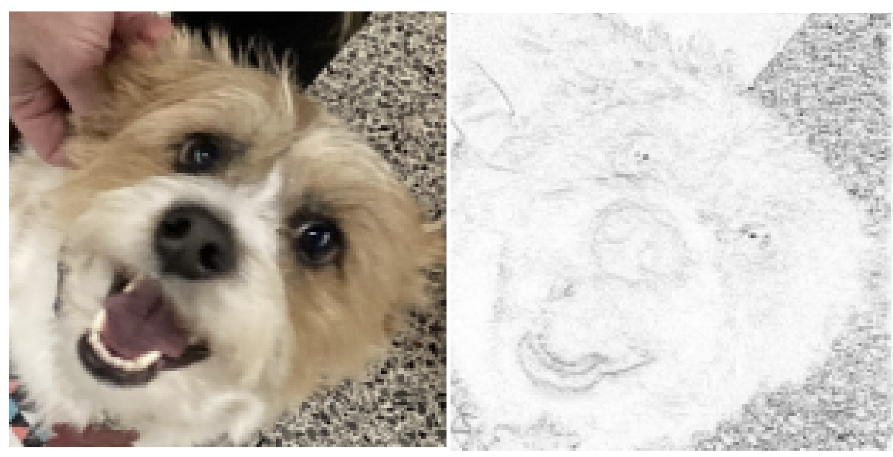
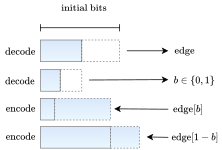
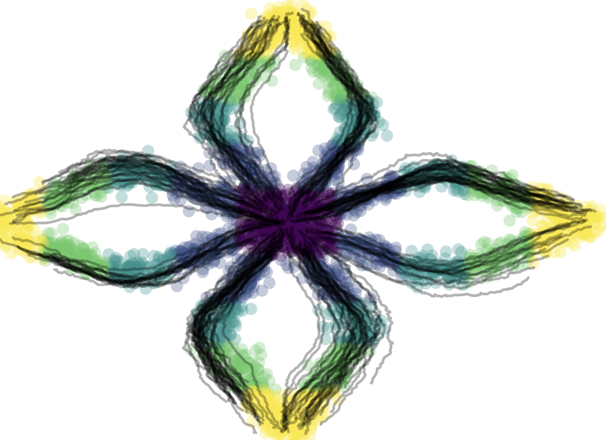
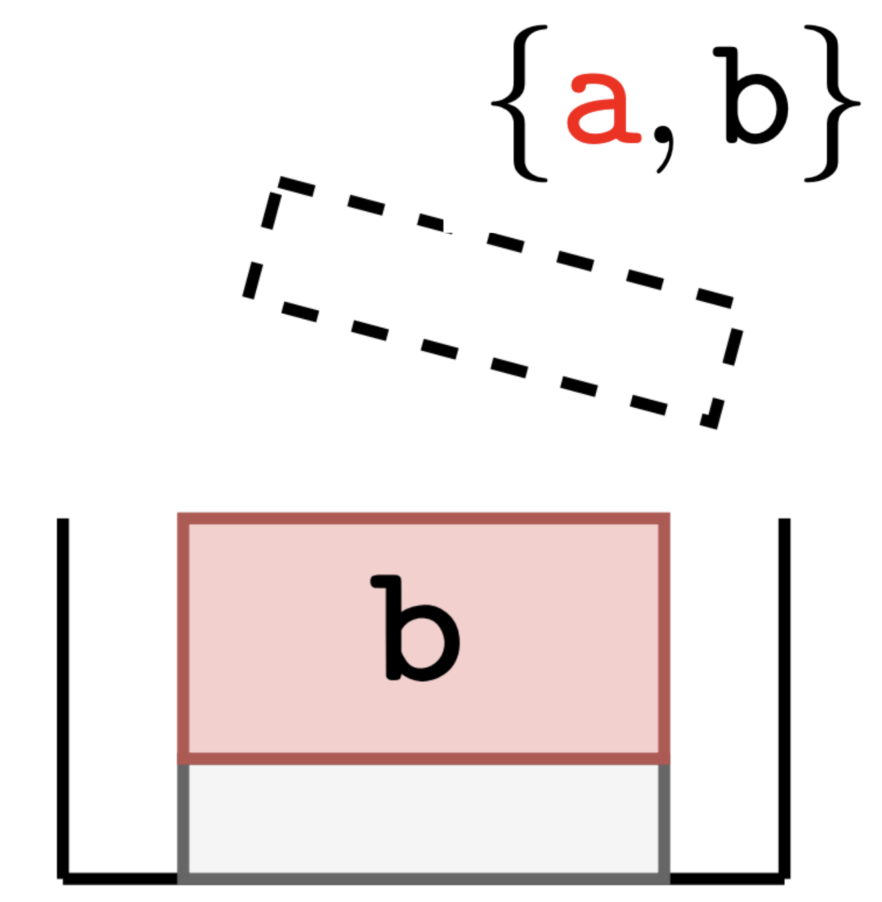

Research Engineer at Meta - Fundamental AI Research (FAIR) Labs.

I'm interested in information theory, machine learning, and AI.

[[google scholar]](https://scholar.google.com/citations?user=5bQjLz4AAAAJ&hl=en)
[[twitter]](https://twitter.com/_dsevero)
[[CV]](https://dsevero.com/cv.pdf)

# Research
My research interests are generative modelling, information theory, and compression under computational and memory constraints.
Data sources usually have some type of structure, such as graphs and sets.
This means we can model and compress them better by taking this structure into account.
Unfortunately, existing methods that do this are either sub-optimal (don't achieve the Shannon bound) or computationally intractable.
I’m interested in building computationally efficient compression algorithms that can be used with deep generative models on structured data, as well as their connections to bayesian methods.

Originally, I am from Florianópolis (Brazil) but I've lived in New Jersey, Orlando, Toronto (now), São Paulo, as well as other smaller cities in the south of Brazil.

Previously, I've interned at the [Fundamental AI Research (FAIR) lab](https://ai.facebook.com/) at Meta with [Karen Ullrich](https://karenullrich.info/) in the summer of 2021.

I spent 2022 at [Google AI](https://ai.google/) with [Lucas Theis](http://theis.io/) and [Johannes Ballé](https://balle.io/) as a Student Researcher.

# Latest News
**April 2024** - I've moved to Montréal to start as a Research Engineer at FAIR Labs!

**March 2024** - [The Unreasonable Effectiveness of Linear Prediction as a Perceptual Metri](https://arxiv.org/abs/2310.05986) and [Entropy Coding of Unordered Data Structures](https://openreview.net/pdf?id=PggJ9CbEN7) were accepted to ICLR 2024.

**August 2023** - I started a second internship at FAIR (Meta AI) in information theory and generative modelling with [Matthew Muckley](https://mmuckley.github.io/).

**April 2023** - [Random Edge Coding](https://arxiv.org/abs/2305.09705) and [Action Matching](https://arxiv.org/abs/2210.06662) were accepted to ICML 2023.

# Tutorials and Workshops
- [ICML 2023 Workshop on Neural Compression and Information Theory](https://neuralcompression.github.io/workshop23), 2023
- [Asymmetric Numeral Systems (ANS) codec in pure Python](https://gist.github.com/dsevero/7e02d96e079ce44b89ff33d7a1ce1738), 2021
- [A tutorial on bits-back with Huffman coding](https://gist.github.com/dsevero/8e7c38b44953964d3b9873b6bd96d9b2), 2021
- [Vectorized Run-Length Encoding](https://gist.github.com/dsevero/693677754798e21f539e4e11a3103576), 2021
- [Persisting lru_cache to disk while using hashable pandas objects for parallel experiments](https://gist.github.com/dsevero/252a5f280600c6b1118ed42826d188a9), 2020

# Recommended readings (not my authorship)
- [Darts, Dice, and Coins: Sampling from a Discrete Distribution](https://www.keithschwarz.com/darts-dice-coins/) by Keith Schwarz, 2011

# Selected Publications and Preprints
For a complete list, please see my [Google Scholar](https://scholar.google.com/citations?user=5bQjLz4AAAAJ&hl=en) profile.

<table>
  <tr>
    <td width="30%"></td>
    <td width="70%">
      <b>The Unreasonable Effectiveness of Linear Prediction as a Perceptual Metric</b> 
      <u>Daniel Severo</u>, Lucas Theis, Johannes Ballé 
      International Conference on Learning Representations (ICLR), 2024 
      
      
    </td>
  </tr>
  <tr>
    <td width="30%"></td>
    <td width="70%">
       
      <b>Random Edge Coding: One-Shot Bits-Back Coding of Large Labeled Graphs</b> 
      <u>Daniel Severo</u>, James Townsend, Ashish Khisti, Alireza Makhzani 
      International Conference on Machine Learning (ICML), 2023  
      
      
    </td>
  </tr>
  <tr>
    <td width="30%"></td>
    <td width="70%">
       
      <b>Action Matching: Learning Stochastic Dynamics from Samples</b> 
      Kirill Neklyudov, Rob Brekelmans, <u>Daniel Severo</u>, Alireza Makhzani 
      International Conference on Machine Learning (ICML), 2023  
      
      
      
    </td>
  </tr>
  <tr>
    <td width="30%"></td>
    <td width="70%">
      <b>Compressing Multisets with Large Alphabets using Bits-Back Coding</b> 
      <u>Daniel Severo</u>, James Townsend, Ashish Khisti, Alireza Makhzani, Karen Ullrich 
      IEEE Journal on Selected Areas in Information Theory, 2023 
      <b>Best Paper Award</b> at NeurIPS Workshop on DGMs, 2021 
      
      
      
      
    </td>
  </tr>
</table>

